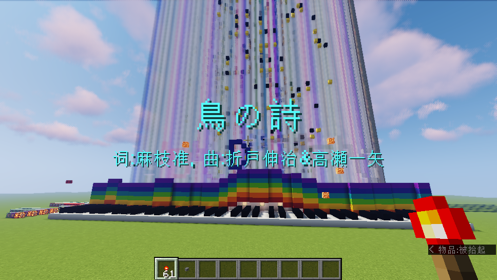

# Simple Redstone Music Generator
[English]()（To be Update）



命令方块式钢琴红石音乐快速生成器。根据手动输入音符到```.csv```表格，通过自定义转换规则自动生成供[litematica mod](https://github.com/maruohon/litematica)导入红石音乐原理图投影文件。

目前支持Minecraft 1.16.2 ~ 1.16.5，理论上可支持1.13 ~ 1.16.X（需要修改`config.py`中的数据版本）。

## Requirements

* python 3
* [NBT](https://github.com/twoolie/NBT)

其中，NBT库可直接通过`pip`安装：

```sh
$ pip install NBT
```

## 使用

首先需要自行准备全音域材质包，最终将以`playsound`命令的形式播放声音。目前本程序仅支持F1-G7共75个音符，但由于使用python写，且经过了尽可能的封装，若有能力可以自行修改python代码定制功能。

如果没有更高级的功能需求，则需要修改的只有`config.py`中的内容。

### 指定声音文件名

需要自定义F1-G7各个音符的文件名，将其名称按顺序存入一个列表，`config.py`中的`playsound_command_list()`函数用于执行此操作。该函数要求返回一个长度**恰好为75**的字符串列表，**依次**对应F1-G7各音符在材质包中的文件名。

项目中的实现是针对[Pianoteq Stage材质包](https://www.mcbbs.net/thread-1103895-1-1.html)实现的，使用不同的材质包应当修改该函数。

### 指定CSV解析规则

程序将读入```.csv```格式的文件，格式按照如下约定：

* 每一列代表一个音轨，行代表时间轴，从第一行开始依次扫描播放
* 表格中的内容是一个字符串，其与音符的对应规则由`config.py`中的`str2keyid`函数定义
* 行扫描速度由`config.py`中`ticks_per_row`变量指定

`str2keyid`函数传入csv中单元格的内容，需要返回一个0-74间的整数，对应F1-G7这个75个音符。不过有以下特例，它们已在程序的较低层次实现，无需在`str2keyid`中处理它们：

* `x`表示停止所在音轨的声音。通常，当同一个音轨播放下一个音符时，会自动停止当前音轨上一个正在播放的声音，因此`x`一般用于休止符，或者和弦后紧跟普通音符需要停止另外音轨声音时使用
* `:`可用于实现琶音，如果在音符后加入后缀`:1`或`:2`，则分别表示该音符会延迟1 tick或2 ticks播放。调用`str2key`时已经去除了此类后缀。
* 由于csv解析采用简单的逗号分隔，因此单元格中请勿包含逗号

项目中给出了`Bird-Poem.csv.sample`，是鸟之诗的前奏，可用于参考。由于目前的样例代码使用Pianoteq Stage材质包，根据其协议，此处仅包含了前奏，完整版请见视频

> 对于任何形式的一键生成（包含自己编写的转换器），请勿发布使用本资源包制作的的作品。

### 程序输出与导入世界

准备好`.csv`表格文件与上述两个函数后，即可开始生成。

```sh
$ python main.py
```

如果程序顺利运行结束，将会在当前目录生成一个目录（数据包），与一个`.litemetica`投影文件。按如下操作导入到地图：

1. 在Minecraft中新建一个超平坦世界，然后生成的目录（默认为`RMGeneratorDatapack/`）粘贴到存档的`datapacks/`目录下，之后重新加载存档以启用该数据包，其中定义了许多函数。
2. 使用l`litematica`模组读取生成出的投影文件，并**将原点设置为(0, 4, 0)**后粘贴至世界，**不得改变朝向**。
3. 在`(-5, 4, -7)`处有一个孤立的命令方块，首次创建世界需要激活它以创建计分板项，执行一次后相同存档无需再执行
4. 丢出一个物品形式的红石火把，即可以开始播放音乐。

## 建议

自动生成较为机械，取得好的效果需要更加细致的调音。本项目只是简化了乐谱导入工作，调音部分仍然需要手动操作。

此外，本项目使用python编写，且经过了尽可能的封装。有能力的玩家可以尝试修改源代码以定制更加复杂而具体的功能。

## 致谢

本项目的红石音乐运行模板，来源于[Ph-苯](https://space.bilibili.com/43760886)的视频[【千本樱】你可能从未见过的掉落沙音乐 ~ MC命令方块版红石音乐](https://www.bilibili.com/video/BV19W411Q7fT)，该视频简介中提供了存档的下载地址，本项目生成的红石音乐基于该存档的模块生成。请在使用过程中保留该作者的有关信息。

由于目前尚未获得原作者本人的回复，因此如果有侵权，我将立刻删除项目中的```template.nbt```，其中包含了红石音乐地图模板信息而无法生成，仅保留代码架构供，供有能力的朋友在此基础上开发不同的生成器。

